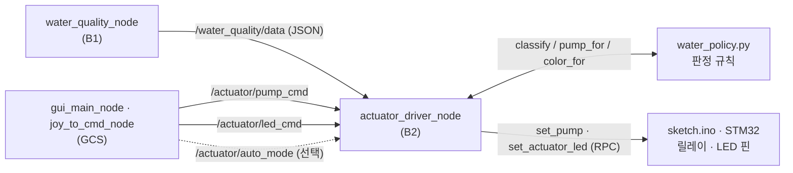

# 🚤 수질 연동 분수 펌프 · RGB LED 자동 제어

B2 보드(`usv_actuators`)가 B1의 수질 측정값을 직접 구독해서, 분수 펌프와 RGB LED를
**사람 개입 없이** 제어한다. 물이 나빠지면 펌프를 돌려 물을 순환시키고, LED 색으로
현재 수질 단계를 밖에서 바로 알아볼 수 있게 한다.

기존에는 GCS에서 사람이 버튼을 눌러야만 펌프·LED가 움직였다. 이제는 자동이 기본이고,
사람이 누르면 그때만 사람 쪽이 우선한다.

---

## 1. 동작 규칙

### 3단계 판정

`/water_quality/data`의 `clarity_pct`(0~100, 클수록 깨끗)를 세 단계로 나눈다.

| 단계 | 조건 | LED | 분수 펌프 |
|---|---|---|---|
| `GOOD` (좋음) | `clarity_pct >= 60` | 🟢 초록 | OFF |
| `NORMAL` (보통) | `40 <= clarity_pct < 60` | 🟡 노랑 | OFF |
| `BAD` (나쁨) | `clarity_pct < 40` | 🔴 빨강 | **ON** |

B1 스케치가 이미 계산해주는 `clarity_level`(5단계 문자열) 대신 `clarity_pct` 숫자를
쓴다. 문자열을 쓰면 임계값을 조정할 때마다 B1 담당자의 스케치를 고쳐 MCU에 다시
업로드해야 하지만, 숫자를 받아 이쪽에서 판정하면 launch 인자만 바꾸면 된다.

### 히스테리시스 — 펌프가 딸깍거리지 않게

경계에서 측정값이 `39.8 ↔ 40.2`로 미세하게 흔들리면 릴레이가 1초마다 on/off를
반복한다. 그래서 한 번 어떤 단계에 들어가면 경계를 `margin`(기본 3.0)만큼 확실히
넘어야 빠져나온다.

- `BAD`에서 나오려면 `clarity_pct >= 43`
- `GOOD`에서 떨어지려면 `clarity_pct < 57`

### 사람이 버튼을 누르면

GCS에서 수동 명령(`/actuator/pump_cmd`, `/actuator/led_cmd`)이 오면 그 값을 즉시
적용하고, `pump_manual_hold_s` / `led_manual_hold_s`(기본 60초) 동안 자동 판정을
억제한다. 시간이 지나면 자동이 다시 판단한다.

"단계가 바뀔 때만 자동이 개입"하는 방식은 쓰지 않았다. 물이 계속 나쁜 상태로
머무르면 단계 변화가 없어서, 사람이 끄고 잊어버린 펌프가 영영 안 켜지기 때문이다.

펌프와 LED의 억제 타이머는 서로 독립이다. LED 색만 바꿔놓고 펌프는 자동에 맡기는
조작이 가능하다.

### 수질 데이터가 끊기면

1초 주기 타이머가 마지막 수신 시각을 확인해서, `stale_timeout_s`(기본 5초) 이상
`/water_quality/data`가 끊기면 펌프를 끈다. B1이 죽거나 Wi-Fi가 끊겼는데 펌프가
켜진 채 방치되면 배터리만 축나기 때문이다.

단, 수동 억제 중에는 건드리지 않는다. 사람이 방금 켠 펌프를 두절 감지가 꺼버리면
안 된다.

---

## 2. 데이터 흐름



자동 입력(`/water_quality/data`)과 수동 입력(`/actuator/*_cmd`)이 **서로 다른 토픽**
으로 도착하기 때문에, 어느 쪽이 보낸 명령인지 노드가 구분할 수 있다.

---

## 3. 인터페이스 — 다른 파트는 고칠 것이 없다

토픽 이름과 메시지 타입은 기존 계약 그대로다. **B1과 GCS는 아무것도 수정하지 않아도
된다.**

| 토픽 | 타입 | 이 노드의 역할 | 비고 |
|---|---|---|---|
| `/water_quality/data` | `std_msgs/String` (JSON) | 신규 구독 | B1은 발행하던 것을 그대로 발행 |
| `/actuator/pump_cmd` | `std_msgs/Bool` | 구독 (기존) | 수동 우선 |
| `/actuator/led_cmd` | `std_msgs/ColorRGBA` | 구독 (기존) | 수동 우선 |
| `/actuator/auto_mode` | `std_msgs/Bool` | 신규 구독 (선택) | 발행자 없으면 자동=켬 |

`/actuator/auto_mode`는 아직 아무도 발행하지 않는다. 나중에 GCS가 자동/수동 토글을
추가할 때 이 노드를 고치지 않고 바로 붙일 수 있도록 미리 구독해 둔 것이다.

MCU RPC(`set_pump`, `set_actuator_led`)는 **값이 실제로 바뀔 때만** 호출한다. 같은
값을 1초마다 다시 보내 Bridge를 낭비하지 않는다.

---

## 4. 파일 구성

문서는 레포 루트, 코드는 `src/` 아래로 분리했다.

```
PUMP_LED.md                       # 이 문서 — 기능 · 규칙 · 실행법
PUMP_LED_논의필요.md              # 조이스틱 충돌 건 (머지 전 결정 필요)
DESIGN_pump_led.md                # 설계 의도와 대안 검토 상세

src/usv_actuators/
├── usv_actuators/
│   ├── water_policy.py           # 판정 규칙 (ROS 무관 · 순수 함수)
│   └── actuator_driver_node.py   # 구독 · 억제 타이머 · MCU 전달
└── launch/actuators.launch.py    # 임계값을 launch 인자로 노출
```

`water_policy.py`에 ROS 의존성을 넣지 않은 이유는, 보드 없이 노트북에서도 판정
규칙을 검증할 수 있게 하기 위해서다.

```python
>>> from usv_actuators import water_policy
>>> water_policy.classify(38.0)
'BAD'
>>> water_policy.classify(41.0, previous='BAD')   # 히스테리시스 — 아직 못 빠져나옴
'BAD'
>>> water_policy.classify(44.0, previous='BAD')
'NORMAL'
```

---

## 5. 실행

```bash
cd usv_ws/src/usv_actuators
./start_actuators.sh
```

임계값은 코드를 고치지 말고 launch 인자로 넘긴다. 실제 수조에서 `clarity_pct`가
어느 범위로 나오는지 보고 조정하면 된다.

```bash
ros2 launch usv_actuators actuators.launch.py bad_below:=35.0 good_above:=55.0
```

| 인자 | 기본값 | 의미 |
|---|---|---|
| `bad_below` | `40.0` | 이 값 미만이면 나쁨 (펌프 ON, LED 빨강) |
| `good_above` | `60.0` | 이 값 이상이면 좋음 (LED 초록) |
| `margin` | `3.0` | 히스테리시스 폭 |
| `pump_manual_hold_s` | `60.0` | 수동 펌프 조작이 자동보다 우선하는 시간(초) |
| `led_manual_hold_s` | `60.0` | 수동 LED 조작이 자동보다 우선하는 시간(초) |
| `stale_timeout_s` | `5.0` | 수질 데이터가 이만큼 끊기면 펌프 정지 |
| `max_pwm` | `255` | 추진기 PWM 최대값 (기존 인자) |

### 하드웨어 없이 확인하기

```bash
# 나쁨 → 펌프 ON, LED 빨강
ros2 topic pub --once /water_quality/data std_msgs/msg/String \
  '{data: "{\"clarity_pct\": 25.0}"}'

# 좋음 → 펌프 OFF, LED 초록
ros2 topic pub --once /water_quality/data std_msgs/msg/String \
  '{data: "{\"clarity_pct\": 80.0}"}'

# 수동 우선 확인 — 이후 60초간 자동 판정이 억제된다
ros2 topic pub --once /actuator/pump_cmd std_msgs/msg/Bool '{data: true}'
```

노드 로그에 `수질 25.0% → BAD`, `수동 펌프 ON (60초간 자동 억제)` 같은 줄이 뜬다.

---

## 6. 아직 안 된 것

- **B2 Arduino 스케치 미작성.** `set_pump`, `set_actuator_led` RPC 핸들러가 MCU 쪽에
  없어서, 컨테이너가 떠도 실제 전기는 흐르지 않는다. ROS 레벨 판정 로직까지는 위
  `ros2 topic pub`으로 전부 검증 가능하다.
- **RPC 이름은 임시.** 실제 릴레이/LED 드라이버 배선을 확정하면서 이름을 맞춰야 한다.
  LED 드라이버가 공통 애노드면 값 반전이 필요할 수 있다.
- **임계값 40 / 60은 가정치.** 실제 수조에서 `clarity_pct`가 어느 범위로 나오는지
  측정한 뒤 launch 인자로 조정할 것.

설계 의도와 대안 검토 과정은 [`DESIGN_pump_led.md`](DESIGN_pump_led.md)에 정리되어 있다.

⚠️ **머지 전에 [`PUMP_LED_논의필요.md`](PUMP_LED_논의필요.md)를 먼저 읽을 것.** 조이스틱
펌프 조작과 자동 제어가 충돌해서, 지금 상태로는 자동 제어가 동작하지 않는다.

