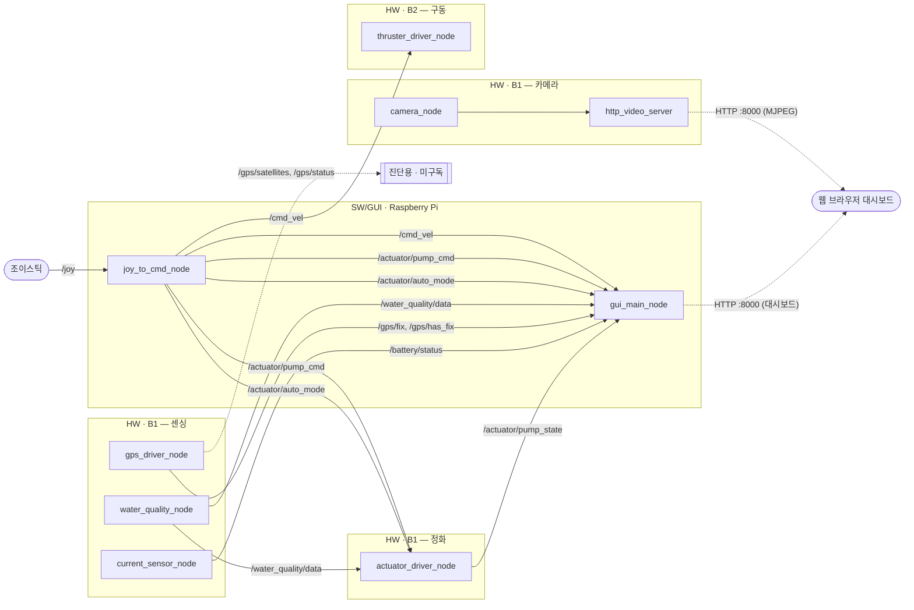

# 🌊 6can
### by Team Eco Bridge AI

> **"우리 동네 호수를 지키는 작은 눈"**
> AI 무인수상정(USV)으로 지역 수질을 실시간으로 관찰하고, 스스로 반응하는 환경 모니터링 시스템

6can은 인천 지역사회의 수질 환경 문제를 해결하기 위해 팀 **Eco Bridge AI**가 진행한
PBL(Problem-Based Learning) 기반 사회공헌 프로젝트입니다. 무인수상정(USV)이 수면을
직접 순찰하며 수질(탁도·pH·용존산소·수온)을 실시간으로 측정하고, 측정값에 따라
정화 펌프가 자동으로 반응합니다. 모든 데이터는 웹 대시보드로 시각화되어 누구나 현재
호수 상태를 확인할 수 있습니다.

---

## 📌 추진 배경 및 문제 정의

인천 지역의 하천·호수는 다음과 같은 구조적인 관리 한계를 안고 있습니다.

| 기존 관리 방식의 한계 | 내용 |
|---|---|
| **낮은 측정 빈도** | 사람이 직접 현장에 나가 정기적으로 샘플을 채취·측정 — 측정 주기 사이의 수질 이상을 놓치기 쉬움 |
| **높은 운영 비용** | 정기 점검마다 인력·출동 비용이 반복적으로 발생 |
| **접근성 사각지대** | 배·선박 없이 접근하기 어려운 구역은 관리 빈도가 더 낮아짐 |
| **시민 체감도 부족** | 수질 데이터가 공개되지 않거나 이해하기 어려운 형태로만 존재해, 환경 문제에 대한 시민 관심으로 이어지기 어려움 |

6can은 이 문제를 "사람이 주기적으로 나가서 재는" 방식에서 "무인선이 상시 관찰하고,
그 결과를 누구나 볼 수 있게 보여주는" 방식으로 바꾸는 것을 목표로 합니다.

---

## 🎯 핵심 목표

- 🌐 **실시간 수질 모니터링** — 탁도, pH, 용존산소, 수온을 무인선이 상시 측정
- 🤖 **자동 반응형 정화** — 측정된 수질 등급에 따라 정화 펌프가 자동으로 작동
- 🕹️ **원격 조종 지원** — 필요 시 조이스틱으로 무인선을 직접 조종 가능
- 📊 **시민 친화적 시각화** — 웹 대시보드에서 실시간 수질·위치·배터리 상태를 누구나 확인
- 💸 **저비용 오픈 하드웨어 기반** — 범용 SBC(Arduino UNO Q)·오픈소스 소프트웨어(ROS 2)로 구현해 재현·확장이 쉬운 구조

---

## 🛠 시스템 아키텍처 및 파트별 역할

6can은 무인선에 탑재되는 **HW(하드웨어 제어) 보드 2대**와, 육상에서 관제하는
**SW/GUI(모니터링·조종) 1대**로 구성됩니다. 보드 간 통신은 ROS 2(DDS)로, 사람이 보는
화면은 웹 브라우저로 분리했습니다.

| 파트 | 보드 | 역할 | 핵심 기술 스택 |
|---|---|---|---|
| 🔧 **HW — 센싱/정화** | B1 (Arduino UNO Q) | 수질·GPS·배터리 전류 센싱, 수면/수중 영상 촬영, 정화 펌프 구동 | ROS 2 Jazzy(Docker), I2C 센서, OpenCV(V4L2 카메라 캡처), MCU RPC |
| 🔧 **HW — 구동** | B2 (Arduino UNO Q) | 추진기 PWM 제어(`/cmd_vel` 구독) | ROS 2 Jazzy(Docker), PWM 모터 드라이버 |
| 💻 **SW/GUI — 관제** | GCS (Raspberry Pi) | 조이스틱 입력 → 조종 명령 변환, 센서/영상 데이터 수신 후 웹 대시보드로 시각화 | ROS 2(네이티브), Python(Flask), HTML5 Canvas, HTTP 폴링·MJPEG 스트리밍 |

**통신 구조**: 보드 사이(B1·B2·GCS)는 ROS 2 DDS 기반 발행/구독(pub-sub)으로 연결되어
있고, GCS는 수신한 최신 상태를 자체 웹 서버(Flask)가 REST 엔드포인트(`/api/state`)로
변환해 브라우저가 주기적으로 폴링하는 구조입니다. 카메라 영상은 B1이 MJPEG로 직접
스트리밍해 GCS를 거치지 않고 브라우저가 바로 수신합니다.

### 📡 시스템 구조도



---

## 💡 기대 효과

| 효과 | 설명 |
|---|---|
| 🌱 **지역사회 수질 환경 개선** | 상시 순찰형 모니터링으로 수질 이상을 조기에 발견하고, 자동 정화 반응으로 대응 시간을 단축 |
| 💰 **지자체 관리 예산 절감** | 인력 기반 정기 수질 조사의 일부를 무인 자동화로 대체해, 반복적인 출동·인건비 부담을 완화 |
| 📣 **시민 환경 인식 제고** | 그동안 비공개·비정기적이던 수질 데이터를 실시간 시각화로 누구나 접근 가능하게 제공해, 지역 환경 문제에 대한 관심과 참여를 유도 |

---

# 🔧 기술 문서 (개발·운영 가이드)

> 아래는 실제로 이 저장소를 빌드·실행·튜닝할 때 필요한 최소한의 정보만 담았습니다.

## ⚙️ 파라미터 체크리스트 (가장 먼저 확인)

현장/하드웨어가 바뀌면 코드를 고치지 말고 아래 값들만 조정하세요.

| 파라미터 | 위치 | 기본값 | 언제 바꾸나 |
|---|---|---|---|
| `camera_host` | `src/usv_gcs/config/gcs_params.yaml` 또는 `gcs.launch.py` 인자 | *(필수, 기본 없음)* | B1 보드의 실제 IP로 설정. 안 하면 카메라 스트림 연결 실패 |
| `linear_axis` / `angular_axis` / `angular_scale` | `gcs.launch.py` 인자 | `1` / `0` / `-1.0` | 실제 조이스틱 축 번호·방향이 다를 때 |
| `pump_button` / `auto_button` | `gcs.launch.py` 인자 | `0`(A) / `1`(B) | 조이스틱 버튼 배치가 다를 때 |
| `max_pwm` | `actuators.launch.py` 인자 | `255` | 실제 모터 드라이버 PWM 사양 확정 후 |
| `bad_below` / `good_above` / `*_manual_hold_s` | `actuators.launch.py` 인자 | `40.0` / `60.0` / `60.0`초 | 실측 수질 범위·자동/수동 우선 시간 조정 시 |
| `SHOW_CAMERA` | `src/usv_gcs/usv_gcs/dashboard_html.py` 상단 상수 | `false` | 웹 대시보드에 카메라 화면을 다시 띄우려면 `true`로 |
| `BACK_GAMEPAD_BUTTON_INDEX` | `dashboard_html.py` 상수 | `8`(추정치) | 실기기로 검증 후 정확한 값으로 |
| `surface_device` / `underwater_device` | `camera_streaming.launch.py` 인자 | `/dev/video0` / `/dev/video4` | USB 카메라 재연결로 장치 번호가 바뀌었을 때 (`v4l2-ctl --list-devices`로 확인) |

`dashboard_html.py`처럼 코드 상수를 바꾼 경우, 파일만 고치고 끝이 아니라
**`gui_main_node`를 재시작**해야 브라우저에 반영됩니다 (HTML/JS가 프로세스 시작 시
메모리에 올라가는 구조라서 `--symlink-install`로도 핫리로드는 안 됩니다).

---

## 🚀 실행 방법

```bash
# 1. B1 (센서 + 카메라 + 정화) — 전원 인가 시 자동 실행되거나
./start_b1.sh

# 2. B2 (추진기) — 전원 인가 시 자동 실행되거나
cd src/usv_actuators && ./start_actuators.sh

# 3. GCS (관제) — 조이스틱 연결 후
sudo apt install ros-jazzy-joy
colcon build --symlink-install --packages-select usv_gcs
source install/setup.bash
ros2 launch usv_gcs gcs.launch.py camera_host:=<B1_IP>

# 4. 브라우저에서 접속
http://<GCS_IP>:8000
```

B1/B2는 `install_*_autostart.sh`로 부팅 자동 실행을 등록해두면 이후엔 전원만 넣으면
됩니다. 개별 보드 빌드/자동 실행 세부 설정, 컨테이너 구성은 `src/<패키지>/` 아래
`start_*.sh`, `systemd/*.service`를 참고하세요.

---

## 🕹️ 조이스틱 구성

하나의 컨트롤러가 **① 실제 보트 조종(ROS)** 과 **② 웹 대시보드 미니 모니터링 화면
조작(브라우저)** 을 독립적으로 처리합니다.

| 구분 | 조작 | 동작 |
|---|---|---|
| 보트 조종 (ROS `/joy`) | 왼쪽 스틱 좌/우 · 상/하 | 좌우 회전 · 전진/후진 (`/cmd_vel`) |
| 보트 조종 (ROS `/joy`) | A 버튼 | 펌프 on/off 토글 |
| 보트 조종 (ROS `/joy`) | B 버튼 | 자동/수동 제어 모드 토글 |
| 웹 화면 (브라우저 Gamepad API) | Start 버튼 | 대시보드 화면 시작 |
| 웹 화면 (브라우저 Gamepad API) | X 버튼 | 화면 내 상호작용(뽑기) 실행 |
| 웹 화면 (브라우저 Gamepad API) | Back 버튼 | 초기 화면으로 복귀 |

버튼 인덱스를 실기기로 확인하려면 브라우저 콘솔(F12)에서:
```js
setInterval(() => console.log(navigator.getGamepads()[0]?.buttons.map((b,i)=>b.pressed?i:null).filter(v=>v!==null)), 300)
```

---

## 📎 참고

- 인터페이스 계약(토픽 이름/타입), 보드별 상세 빌드 옵션, Docker/systemd 구성은 각
  패키지(`src/usv_sensors`, `src/usv_actuators`, `src/camera_streaming`, `src/usv_gcs`)의
  launch 파일과 스크립트 주석에 정리되어 있습니다.
- `usv_actuators` 패키지는 `actuator_driver_node`(펌프, B1에서 실행)와
  `thruster_driver_node`(추진기, B2에서 실행) 두 실행 파일을 포함하며, 배포
  스크립트(`start_b1.sh`/`actuators.launch.py`)의 보드별 분리 정리는 진행 중입니다.
